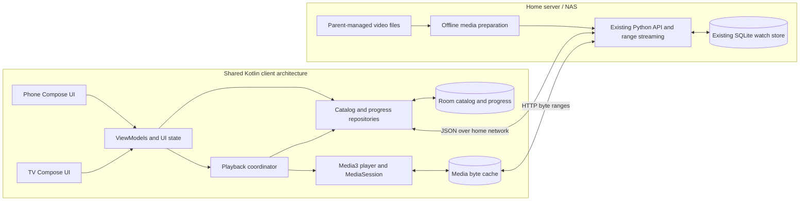
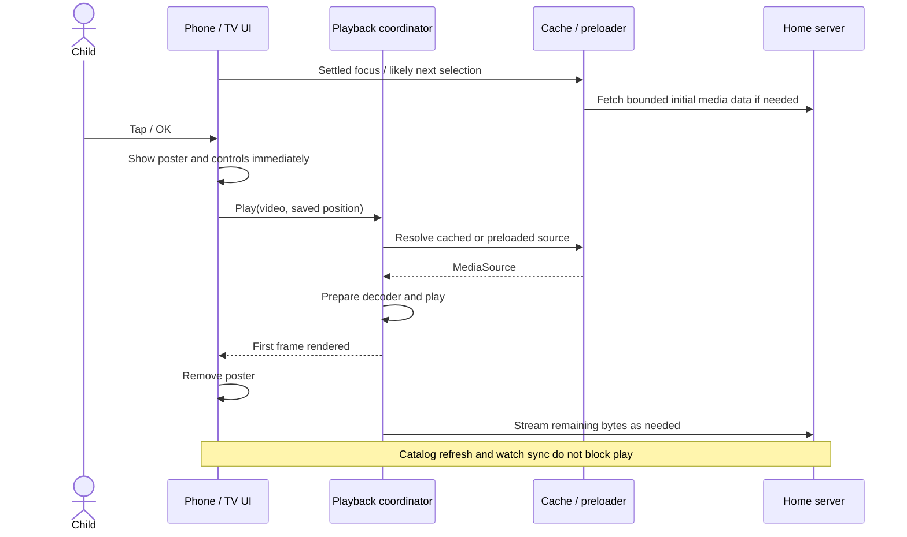

# FamilyTube: Android phone and TV architecture

Design date: 2026-09-29. Updated 2026-10-02: S0/S1 scaffold, S2 playback, S3 Room catalog/progress/outbox, and S4 phone browsing/watch implemented. Physical-device verification is deferred by the user. See [implementation notes](docs/IMPLEMENTATION_NOTES.md), [S3 verification](docs/S3_VERIFICATION.md), [S4 verification](docs/S4_VERIFICATION.md), and [media preparation](docs/MEDIA_PREPARATION.md) for observed evidence and remaining gaps.

## 1. Product and key decisions

Build two native Kotlin applications in one Android Studio project: a touch interface for phones and a remote-controlled interface for Android TV. Share the catalog, storage, playback engine, and playback state. Give each device its own navigation and player controls.

The videos live on the home server/NAS and stream over the home network, as selected by the user. Internet access is unnecessary for normal viewing. Start with the existing Python backend in `../backend`; do not introduce another backend stack.

The experience should closely follow familiar YouTube browsing and playback: large thumbnails, instant selection feedback, a red timeline, unobtrusive overlay controls, related videos, and remote-friendly TV rows. FamilyTube keeps its own name and assets. Visual fidelity comes from custom UI work; using a playback library alone does not reproduce YouTube's interface or responsiveness.

| Decision | Choice | Reason |
| --- | --- | --- |
| Client language | Kotlin throughout | Native Android UI and media integration |
| Applications | `app-mobile` and `app-tv` | Independent launchers and device-specific interaction |
| Phone UI | Jetpack Compose + Material 3, custom styling | Touch gestures and responsive layouts |
| TV UI | Compose + TV Material, custom styling | Focus, remote navigation, readable controls |
| Playback | AndroidX Media3 ExoPlayer | Local HTTP streaming, seeking, caching, media sessions |
| Presentation | ViewModel + immutable StateFlow + unidirectional events | Predictable state and testable behavior |
| Local data | Room; DataStore for preferences | Immediate cached home screen and durable progress |
| Networking | Shared OkHttp client; Retrofit + Kotlin serialization for JSON | Connection reuse and typed backend contracts |
| Images | Coil | Sized thumbnail requests, memory and disk caching |
| Dependency injection | Hilt | Explicit application and playback-session ownership |
| Initial media delivery | Progressive MP4 over HTTP byte ranges | Small library and a home network need little infrastructure |
| Platform baseline | Proposed minSdk 26, subject to actual device inventory | Keep the initial compatibility matrix manageable |

Pin compatible stable dependencies in `gradle/libs.versions.toml` when scaffolding. Keep all Media3 artifacts on the same version. Set compile/target SDK against current Android requirements at implementation time.

Compose TV components supply remote-oriented interactions, while ordinary Compose Foundation lazy lists support TV focus scrolling. Use TV Material in the TV shell and mobile Material in the phone shell. [Compose for TV](https://developer.android.com/training/tv/playback/compose), [TV lists](https://developer.android.com/training/tv/playback/compose/lists).

## 2. Scope

**First release:** server setup, cached home screen, category browsing, local title search, continue watching, full-screen player, resume, related videos, optional autoplay, TV remote controls, parent settings, and clear offline/error states.

Keep recommendations simple: use the existing backend suggestions, with a cached category/recently-added fallback. Every suggestion comes from the supplied family library. Adding files to the designated library is a parent action; the existing scanner does not classify whether a video is suitable for children.

Autoplay defaults to off and is parent-controlled. Parent settings include the server address, autoplay, cache limit, and a local PIN gate. The PIN prevents accidental child changes in the UI; it is not server authentication.

**Later:** a Shorts option for small, short-form videos from the family library, explicit offline downloads, child profiles shared across devices, subtitles when supplied, seek-preview sprites, PiP, multiple quality renditions, and optional server discovery. Shorts is planned after the first release; define its duration/file-size limits, feed layout, and phone/TV navigation during that phase. Reuse the shared playback engine and bounded preloading strategy.

**Not planned:** an in-app mini-player.

**Outside the initial scope:** public accounts, ads, comments, uploads from the child UI, subscriptions, live streaming, casting, and public YouTube integration.

## 3. System design



The shared architecture is compiled into each APK. Phone and TV have independent player instances, caches, preferences, and databases. They share video files through the server; a Kotlin singleton does not span devices.

For a small library, download the whole catalog into Room. Search and category filtering run locally. Refresh on launch, foreground return when stale, and explicit refresh. Network calls must never be required before displaying previously cached items or starting a video whose URL is already known.

## 4. Project layout

```text
client/
  app-mobile/             # Mobile Activity, navigation, screens, touch controls
  app-tv/                 # TV Activity, navigation, screens, focus and remote controls
  core/
    model/                # Video, catalog identity, progress, shared value types
    data/                 # API DTOs, Room, repositories, preferences, sync outbox
    playback/             # ExoPlayer, preload policy, cache, MediaSession, state
    designsystem/         # Colors, spacing, icons, shared unthemed visual primitives
  benchmark/              # Planned in S6 for device journeys and performance measurements
  gradle/libs.versions.toml
  build.gradle.kts
  settings.gradle.kts
```

Dependency direction: both apps depend on the shared modules; `data` and `playback` depend on `model`; `model` depends on neither app. Put repository interfaces and domain values in `model`, with implementations in `data`. Inject progress persistence into `playback` through an interface. Shared design primitives must not import either platform's Material theme.

Keep screen features as packages within each app initially: `home`, `search`, `watch`, and `settings`. A small library does not justify a separate Gradle module and use-case class for every screen or button.

## 5. Phone and TV interaction design

| Area | Phone | Android TV |
| --- | --- | --- |
| Home | Top app bar, category chips, large 16:9 cards, bottom Home/Library navigation | Left navigation rail, category rows, large 16:9 cards |
| Selection | Tap card to play directly | D-pad focus, OK to play directly |
| Watch | Inline 16:9 player above title and related videos; landscape fullscreen | Fullscreen video with overlays; related row opens on demand |
| Controls | Center play/pause, double-tap sides for +/-10 seconds, scrubber, fullscreen | Center OK shows controls; focused play/pause toggles; dedicated media keys work |
| Seek | Drag timeline; commit seek on release | Focus timeline, Left/Right changes preview position, OK commits; Back cancels |
| Back | Fullscreen to watch; leaving watch saves progress and stops playback | Hide overlay first; next Back returns to catalog and stops playback |
| Return to catalog | Restore list scroll; playback is stopped | Restore exact card focus and row scroll |
| Theme | Dark default; optional light later | Dark with a strong visible focus border |

Use a near-black background, white titles, muted metadata, compact spacing, rounded thumbnail corners, duration badges, and a red progress line. Use actual poster images rather than decoding video frames while scrolling. Show only meaningful metadata from this small library; do not invent view counts or channels.

Keep controls readable over a bottom gradient. Phone touch targets are at least 48 dp. TV controls and labels need larger spacing and physical-device validation at normal viewing distance. Focus should use a border plus modest scale without changing layout geometry. Expose accessible labels, playback state, and scrubber semantics; avoid color-only focus indicators.

Controls hide after approximately three seconds of inactivity while playing. Keep them visible while paused, scrubbing, or showing an error. Any relevant remote interaction reveals controls before moving focus. A dedicated play/pause key always acts immediately. Related rows must never silently take focus during playback.

```text
PHONE HOME                       TV HOME
+-------------------------+      +-------------------------------------------+
| FamilyTube       Search |      | Nav | Continue watching                   |
| All  Songs  Stories     |      |     | [16:9 card] [16:9 card] [16:9 card] |
| [       16:9        ]   |      |     | Songs                               |
| Title        duration   |      |     | [16:9 card] [16:9 card] [16:9 card] |
| [       16:9        ]   |      +-------------------------------------------+
|                         |
| Home            Library |      TV PLAYER
+-------------------------+      +-------------------------------------------+
                                 |                VIDEO                      |
                                 | Title                                     |
                                 |       previous    play/pause    next       |
                                 | 00:42 =========o------------------ 04:20   |
                                 +-------------------------------------------+
```

These are structural wireframes. Exact dimensions, animations, and icon placement should be refined against screenshots and device recordings during the UI milestone.

## 6. Playback ownership and lifecycle

One `PlaybackCoordinator` owns one ExoPlayer, one MediaSession, and one preload manager per active app playback session. Never create a player per card or inside a composable body.

An Activity-scoped retained owner holds the coordinator across configuration changes. Screens attach to its read-only state and send commands. The coordinator uses application context; Activities and surfaces must not be retained after destruction. All player commands run on the player's application looper.

Use Media3 Compose `PlayerSurface`/`ContentFrame` with a SurfaceView-backed surface and custom Compose controls. Keep the player surface in a stable player host while the mobile watch screen is open; change its bounds between inline and fullscreen without rebuilding the player. Leaving watch saves progress, stops playback, cancels preloading, and detaches the surface. Keep controls separate from the surface. Validate resize, rotation, clipping, and first-frame behavior on actual devices. [Media3 surface guidance](https://developer.android.com/media/media3/ui/surface).

Create a MediaSession for system and TV transport controls. MVP playback is foreground-only: pause on backgrounding, persist progress, cancel preloading, and release the session/player once the app is genuinely stopped. Keep the owner through configuration changes; rebuild from saved state when returning after a real stop. Never resume audio automatically after process death. PiP/background playback would require a separately designed lifecycle, with service ownership if background playback is introduced. [MediaSession](https://developer.android.com/media/media3/session/control-playback).

Define two independent states:

- Playback: `Idle`, `Preparing`, `ReadyPaused`, `Playing`, `Buffering`, `Ended`, `Failed`.
- Presentation: `Inline`, `Fullscreen`; plus controls visibility and seek-preview position.

Changing presentation never resets the media item. Explicitly handle audio focus, headphones disconnecting, TV Home, screen off, end of media, and loss of the server. Keep the screen awake only during active viewing.

Conceptual Kotlin boundary (a design contract, not compiled implementation):

```kotlin
interface PlaybackController {
    val state: StateFlow<PlaybackState>
    fun play(video: Video, startPositionMs: Long = 0L)
    fun pause()
    fun resume()
    fun seekTo(positionMs: Long)
    fun stop()
}
```

The playback module also supplies a narrow surface binding for the Media3 Player. UI code may bind that player to a surface; it must not independently set its media item, release it, or mutate the queue. Route commands through the coordinator so there is one source of playback truth.

Use a selection generation/token so a slow preparation callback for video A cannot override a newer selection of video B. Coalesce scrub movement and perform the actual seek on release/confirmation. Update progress UI approximately every 250 ms only while visible; do not recompose the entire home or watch screen for every progress tick.

## 7. Fast startup and fluid playback

“Instant play” is a performance goal, not a guarantee: network latency, storage speed, codec initialization, and the device still matter. The strategy has four parts.

### A. Prepare files before viewing

The current library contains MP4 and WebM. Container extension does not prove hardware decoder support. Inspect codec, profile, resolution, frame rate, and audio before choosing the playback rendition. Media3 generally relies on device decoders. [Supported formats](https://developer.android.com/media/media3/exoplayer/supported-formats).

For a predictable initial device matrix, prepare H.264 8-bit SDR + AAC MP4, up to 1080p with a 720p option for weaker devices if required. Select codec profile/level and bitrate from measured device support. Put the MP4 index (`moov`) at the beginning for fast startup. Use roughly two-second keyframe spacing as an initial encoding choice for seeking. Remux only when codecs already match; otherwise transcode once on the server before publication.

Generate thumbnails and duration during import. Write prepared files to a temporary location, then publish atomically when complete. Preserve original files. Never transcode in response to a child's Play action. The existing scanner is not a transcoding pipeline; this preparation is proposed work.

Start with one compatible progressive rendition. HLS is a later option if variable network conditions demonstrate a need for adaptive quality. A quality menu only appears when real alternate renditions exist.

### B. Render cached state immediately

Home observes Room first and refreshes in the background. Use stable item keys, fixed card aspect ratios, thumbnail requests sized for the view, and lightweight placeholders. Database access, file scanning, cache initialization, and image decoding must stay off the UI thread.

Reuse HTTP connections. Keep catalog sync, watch sync, and thumbnail fetching off the critical playback path. On selection, show the poster and controls immediately; remove the poster only when the first video frame renders. A poster is not counted as playback start.

### C. Cache media bytes

Use one application-owned `SimpleCache` instance per cache directory and a shared `CacheDataSource.Factory` for playback and preloading. Initialize the cache off the main thread; keep its lifetime longer than any player using it. Proposed initial disk quotas: 512 MiB on phone, 256 MiB on TV, reduced when storage is limited. Use LRU eviction for this disposable streaming cache. [Media3 caching](https://developer.android.com/media/media3/exoplayer/network-stacks).

Key entries by `serverIdentity + videoId + contentVersion + renditionId`. The current backend lacks `contentVersion`; add a version that changes whenever bytes change before enabling persistent media reuse across catalog refreshes. Do not assume an unchanged URL means unchanged content. Until that field exists, namespace media cache entries by a fresh catalog generation and invalidate across refreshes; accept reduced reuse.

S3 generates and persists a local UUID for each normalized server origin in Room. Returning to an origin restores that library's catalog/history; changing origins isolates them. Updating the address of the same server currently creates another library. An explicit same-library migration flow or server-provided identity is deferred. Media byte caching remains S6 work.

### D. Preload a small set of likely selections

Start with one candidate: the settled focused TV card, the most likely visible mobile card after scrolling stops, or the next video when autoplay is enabled. Debounce focus/scroll changes by approximately 250 ms. Prepare the media source and preload about two seconds of compressed media; do not open additional hardware video decoders for browsing previews.

Use `DefaultPreloadManager` with an explicitly ordered candidate list; the catalog's two-dimensional TV layout must be mapped to that ordering by app policy. Construct the player through the same preload-manager builder and hand its preloaded MediaSource to that player on selection. This shared construction is required for compatible preloaded playback. [Preload concepts](https://developer.android.com/media/media3/exoplayer/preloading-media/preloadmanager/concepts), [play preloaded media](https://developer.android.com/media/media3/exoplayer/preloading-media/preloadmanager/manage-play).

Keep candidate count bounded and impose a proposed 8 MiB preload allocation budget in addition to active playback buffers. Stop speculative work under memory pressure, backgrounding, or active playback buffering. Release removed candidates promptly; release the preload manager before its player. Adjust these initial limits using device measurements. [Preload resource management](https://developer.android.com/blog/posts/elevating-media-playback-a-deep-dive-into-media3-s-preload-manager-part-2).

Keep Media3's default load-control behavior initially. Lower startup buffering only after measurements show a benefit without increased rebuffering. Zero startup buffering is not a useful product requirement.



## 8. Existing backend integration

The following routes were checked in `../backend/server.py`; this is an integration design, not a live-server availability check. `DEPLOYMENT.md` documents `http://192.168.10.151:8000`; use it as a setup hint, never a hard-coded app dependency.

| Existing endpoint | Client usage |
| --- | --- |
| `GET /api/health` | Validate saved server during parent setup |
| `GET /api/videos` | Full catalog snapshot for Room |
| `GET /media/{id}` | Stream/seek; server supports byte ranges and 206 responses |
| `GET /thumbnails/{path}?v=...` | Versioned thumbnail loading |
| `GET /api/watch/history` | Fetch per-device progress |
| `POST /api/watch` | Send durable playback progress snapshots |
| `GET /api/recommendations` | Optional server ordering; local fallback if unavailable |
| `GET /api/scan` | Display server scan status in parent settings |
| `POST /api/scan`, `POST /api/scan/settings` | Parent-triggered scan and schedule changes |

Catalog fields currently include `id`, `title`, `description`, `category`, `duration`, `file`, `addedAt`, `thumbnailUrl`, `streamUrl`, `accent`, and `age`. Treat missing thumbnails and zero/unknown duration as normal; the player supplies actual duration after preparation. Display an unknown duration without a misleading zero-time badge.

The current API represents duration, position, and watched time in seconds; use milliseconds inside Kotlin and convert at the API boundary. `updatedAt` and `addedAt` use epoch milliseconds. Do not confuse `duration = 0` with a completed item.

Persist an installation UUID and pass it as `X-Device-ID` to the history, recommendations, and mutation routes. The current backend keeps history per device; it does not provide shared child profiles or automatic cross-device resume. That future feature needs a separate profile identity and server contract.

Watch snapshot contract:

```json
{
  "videoId": "catalog-video-id",
  "sessionId": "persistent-playback-session-uuid",
  "sequence": 1,
  "position": 42.5,
  "duration": 240.0,
  "watchedSeconds": 18.0,
  "updatedAt": 1790632800000
}
```

Create a new session ID for a new viewing session; persist it and its monotonically increasing sequence with outgoing events. `watchedSeconds` is cumulative actual playing time within that session, excluding pauses and seeks. Retrying the same snapshot keeps the same sequence. The server ignores stale/duplicate session sequences, so retries are safe.

Save locally every five seconds and on pause, seek completion, stop, and item changes. Coalesce unsent snapshots per session into a Room outbox. Sync asynchronously while foregrounded and retry pending records using WorkManager; persist before scheduling. Show local progress immediately and reconcile server snapshots by timestamp. Clamp invalid positions; resume near-end items from the beginning according to a documented product rule, initially within the final 10 seconds or at least 95% watched by position.

S3 implements these behaviors through the model's `ProgressStore` boundary. An application-owned ordered writer completes earlier saves before a resume lookup, without blocking the player thread. Selection tokens reject older lookups. Local pending events win over fetched history; otherwise only strictly newer history replaces local progress. Acknowledging a sent sequence cannot delete a newer coalesced event. Foreground sync requests are conflated; a unique WorkManager retry task uses eight attempts with exponential backoff starting at 30 seconds. Periodic recovery runs on a 15-minute minimum interval, subject to OS scheduling. No validated-internet constraint is applied, because LAN-only Wi-Fi must work. Permanent 400/404/410 watch rejections discard the outbox event while retaining local progress. Server recommendation order is stored with catalog entries; unavailable recommendations fall back to cached category/recent items.

Proposed backend extensions, separate from existing behavior:

- Stable `serverId`, content version, MIME type, codec information, and optional rendition list.
- Offline preparation of thumbnails, durations, and compatible playback files.
- Optional catalog version/ETag for efficient refresh.
- Server authentication and shared profiles only if those capabilities are later requested.

The Python range server is sufficient as a starting design for a few streams. Measure concurrent playback before considering a reverse proxy or separate static-file server.

## 9. Network, storage, and failure behavior

Parent setup accepts an editable server URL and tests it once. Subsequent viewing uses the saved connection. LAN access must not depend on Android reporting validated internet connectivity: a Wi-Fi network without internet is a valid home-server network.

Configure `INTERNET` and connectivity monitoring. Handle runtime local-network access where required; current Android guidance requires `ACCESS_LOCAL_NETWORK` for apps targeting Android 17/API 37 or higher. Provide a useful denied-permission state. [Local network permission](https://developer.android.com/privacy-and-security/local-network-permission).

The current server uses cleartext HTTP and no authentication. Supporting arbitrary parent-entered LAN addresses requires an intentional Android cleartext network-security configuration. Restrict app requests and redirects to the configured server origin, including thumbnail and stream URLs. This design assumes a trusted home network; a device ID and a client PIN are not security boundaries for the API.

| Situation | Behavior |
| --- | --- |
| Server offline | Show cached library and a clear connection status; fail unavailable playback with Retry |
| Wi-Fi drops during playback | Play already buffered bytes; retry at saved position with capped backoff; offer manual Retry |
| Video removed | Stop retrying 404; refresh catalog and show “Video is no longer available” |
| Unsupported codec | Show a useful playback error and flag the file for parent-side preparation |
| Thumbnail missing | Show fixed-size neutral artwork; keep scrolling stable |
| Cache full or unwritable | Evict where possible or stream without disk writes; retain progress separately |
| App killed | Restore catalog and saved progress on next launch; wait for an explicit play action |
| Server address changes | Parent updates connection; preserve library identity only when confirmed as the same server |

A partially cached stream is not an offline download. Do not label it “available offline.” In a later offline-download milestone, use Media3 DownloadManager/DownloadService with a separate non-evicting cache, explicit storage limits, and a completed-download index; resolve playback to the completed copy first. [Media3 downloads](https://developer.android.com/media/media3/exoplayer/downloading-media).

## 10. Performance targets and validation

These are proposed acceptance targets, not measured results. Benchmark release-like builds on the actual family phone and the weakest target TV, using prepared 720p/1080p media, stable home Wi-Fi, and a warm server. Record network throughput, codec, cache state, and device model with results.

| Metric | Initial target |
| --- | --- |
| Selection feedback | Poster/control response within 100 ms, p95 |
| Warm, preloaded selection to first rendered frame | At most 300 ms, p95 |
| Cold, uncached selection to first rendered frame | At most 1 second, p95 on the reference LAN |
| Cold app launch to interactive cached home | At most 1.5 seconds, p95 |
| Browsing and control animation | Target 60 fps on 60 Hz devices, under 1% janky frames on defined journeys |
| Stable-network viewing | No rebuffer events in a 20-minute reference run |
| Resume durability | At most five seconds of ordinary progress lost after abrupt process death |

Measure tap/OK to Media3 first-frame callback using a monotonic clock; do not substitute `STATE_READY` for visible video. Separate uncached, disk-cached, and memory-preloaded runs. Use at least 30 repetitions per startup scenario and report both median and p95. Track rebuffer duration, dropped frames, and preload hit rate. Inspect memory during repeated scrolling and video switching for growth and decoder leaks.

Use Macrobenchmark for startup and scrolling, plus Media3 analytics for playback timings. Generate Baseline Profiles for home, navigation, play, and return to browsing. Verify the release build benefits on physical devices. [Macrobenchmark](https://developer.android.com/topic/performance/benchmarking/macrobenchmark-overview), [Baseline Profiles](https://developer.android.com/topic/performance/baselineprofiles/overview).

Functional acceptance journeys: browse -> play -> seek -> pause -> resume; phone rotation/fullscreen without restarting media; leaving watch saves progress and stops playback; TV focus restoration and complete D-pad navigation; rapid A/B selection; Wi-Fi loss and recovery; server restart; removed/replaced media; process death and progress recovery; two devices playing simultaneously. Test range seeking and repeated outbox delivery against the existing backend.

Add targeted tests for API unit conversion, progress event sequencing, cache identity/version changes, and playback selection races. UI tests cover focus and navigation behavior. Performance success must be demonstrated on devices, not inferred from unit tests or an emulator.

## 11. Delivery order

The detailed [execution plan](EXECUTION_PLAN.md) expands these milestones into stages with dependencies, completion checks, and a progress tracker. See the repository [agent instructions](../AGENTS.md) for implementation rules.

1. **Playback proof:** scaffold the shared Kotlin project and both launchers; connect to the existing API; play and seek on the real phone and TV. Inspect representative MP4/WebM files and settle the compatible import format. Exit when both devices reliably decode the selected rendition.
2. **Core experience:** implement cached catalog, home/search, custom player controls, persistent progress, TV focus restoration, and phone fullscreen. Save progress and stop playback when leaving watch. Exit when the core family viewing journeys work end to end.
3. **Responsiveness:** add version-safe byte caching, bounded preloading, sized thumbnail loading, and stable player-surface transitions. Add performance instrumentation and Baseline Profiles. Exit when the reference-device targets pass or documented measurements justify revised budgets.
4. **Family release:** add parent settings, autoplay policy, disconnected states, recovery, signed phone/TV APKs, and installation notes. TV packaging includes the Leanback launcher category, TV banner, and no touchscreen requirement; phone packaging uses its normal launcher.
5. **Shorts, later phase:** add a dedicated Shorts option for small, short-form videos from the family library. Define content limits and touch/remote navigation, then reuse the shared player, cache, and bounded preloading. Shorts is not part of the first release.
6. **Optional enhancements:** explicit offline downloads, shared child profiles, seek previews, subtitles, PiP, or adaptive quality based on actual family use.

The implementation uses typed catalog/history/watch DTOs, Room catalog/progress/outbox tables, DataStore installation/settings identity, and an Activity-retained playback ViewModel with one ExoPlayer/MediaSession per app session. S4 implements phone Home/Library, local search/category chips, thumbnail cards, continue watching, cached related items, inline/landscape fullscreen, double-tap seek, release-only scrubbing, and controls timeout. Scroll states live above screen navigation, and a stable watch host changes surface bounds without resetting the media item. Position ticks update the controls independently from the surface and related list. Phone artwork uses one application-owned Coil loader sharing the redirect-restricted HTTP pool; bitmap sizing follows card constraints. Physical resize/focus/accessibility checks remain pending.

TV still uses functional proof screens; complete remote/focus navigation belongs to S5. Media byte caching, preloading, parent controls, and release validation remain in later stages. Builds, tests, and emulator journeys are recorded in the execution plan and S3/S4 reports. Physical-device performance and family-media compatibility remain unverified.
