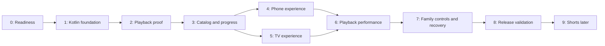

# FamilyTube execution plan

Status: S0/S1 scaffolded; S2 playback checked on phone and Google TV emulators; S3 and S4 implemented and verified for the current emulator scope. Physical-device/media checks are deferred at the user's request.

This plan implements [the architecture](ARCHITECTURE.md). Repository-wide [agent instructions](../AGENTS.md) define how to execute and report the work.

## Scope and execution order

First release: native Kotlin phone and TV apps, home-server streaming, familiar YouTube-style browsing/player controls, cached catalog, resume, recommendations, optional autoplay, and parent settings. There is no in-app mini-player. Leaving watch saves progress and stops playback.

Shorts for small, short-form videos is planned after the first release. Offline downloads, shared profiles, PiP, and other optional features remain separate follow-up work.

Stages are delivery checkpoints, not automatic requests for approval. When implementation is authorized, continue through the requested scope and maintain this tracker. The estimates should be set after the toolchain and actual test devices are known; stage completion is based on evidence, not elapsed time.



Phone and TV UI stages can be developed independently after shared contracts stabilize. This dependency diagram does not require multiple agents. Family-control and recovery work may start earlier where it does not depend on unfinished playback changes.

## Stage tracker

Use `Not started`, `In progress`, `Verification pending`, `Blocked`, `Complete`, or `Deferred`. Record the exact missing prerequisite for a blocked stage. Do not mark a stage complete when its hardware checks remain pending.

| Stage | Deliverable | Dependencies | Status |
| --- | --- | --- | --- |
| S0 | Environment, device matrix, API/media audit | None | Verification pending |
| S1 | Buildable phone and TV Kotlin shells | S0 toolchain decisions | Verification pending |
| S2 | Working playback on both devices | S1 | Verification pending |
| S3 | Cached catalog and durable progress | S2 shared playback contract | Complete |
| S4 | Complete phone viewing experience | S3 | Complete |
| S5 | Complete TV viewing experience | S3 | Not started |
| S6 | Version-safe caching, preloading, performance | S4, S5 | Not started |
| S7 | Parent settings and failure recovery | S6 integration | Not started |
| S8 | Verified phone/TV release artifacts | S0-S7 exit criteria | Not started |
| S9 | Shorts experience | S8 and later-phase scope | Deferred |

## S0 - Establish readiness

**Work**

- Inspect current source, repository instructions, and existing backend tests. Preserve unrelated changes.
- Check Java, Android SDK, build tooling, ADB, Python, and available media inspection tools. Record versions and missing setup; do not assume the SDK is installed.
- Record the real phone and TV model, Android version, memory/storage constraints, and installation/ADB access when available. Keep unknown values explicit.
- Confirm proposed minSdk 26 against the devices and select compatible stable Kotlin, AGP, Gradle, Compose, and Media3 versions using official documentation.
- Inspect representative MP4 and WebM codec/size/duration data. Decide which files need compatible playback copies; preserve originals.
- Inspect API responses and run existing backend tests. Use a temporary local server for integration fixtures; treat the deployment address as a hint until verified.

**Deliverables:** `docs/IMPLEMENTATION_NOTES.md` containing the toolchain, device matrix, API observations, media compatibility findings, and remaining prerequisites.

**Exit checks:** a reproducible build setup is identified; API expectations are recorded; media preparation requirements are known. Missing device access remains visible and does not prevent independent scaffolding work.

## S1 - Scaffold the Kotlin project

**Work**

- Create `app-mobile`, `app-tv`, `core:model`, `core:data`, `core:playback`, and `core:designsystem` under `client/`.
- Add the Gradle wrapper, Kotlin build scripts, version catalog, dependency injection, and package/application IDs.
- Add separate launchers, a TV banner, TV touchscreen declarations, and dark FamilyTube themes. Keep mobile and TV Material themes separate.
- Add a minimal server-address setup screen with persisted preferences and connectivity feedback. Configure LAN HTTP access and relevant target-SDK permissions deliberately.
- Add build-output/SDK/signing exclusions and document real build commands in `README.md`.

**Deliverables:** buildable phone and TV debug APKs with an initial screen and editable server configuration.

**Exit checks:** both apps assemble and lint; each launches on an available compatible target. Document device verification still pending separately from compilation success.

## S2 - Prove playback end to end

**Work**

- Load the existing video catalog through typed DTOs and show a minimal selectable list in both apps.
- Implement one playback coordinator per app session, MediaSession, video surface, play/pause, seek, duration, and first-frame observation.
- Prove lifecycle behavior: rotation/fullscreen keeps playback; leaving watch stops it; backgrounding pauses it; process recreation waits for explicit play.
- Guard rapid selection changes so stale work cannot take over the player.
- Generate compatible playback copies where required using a documented preparation command/tool, publishing only completed output and preserving originals.
- Start collecting selection-to-first-frame measurements before adding preloading.

**Deliverables:** browse -> play -> seek -> stop on phone and TV, plus media preparation instructions.

**Exit checks:** representative videos play and seek on physical phone and TV; range requests work; repeated switching does not produce overlapping audio or leaked players. If hardware is unavailable, mark device verification pending and keep the limitation in subsequent stage reports.

## S3 - Build shared catalog and progress storage

**Work**

- Add Room catalog, progress, and watch-event outbox tables; keep preferences in DataStore.
- Render local catalog state immediately and refresh it in the background. Implement local title search and category filtering.
- Generate the installation ID and integrate history/recommendations with `X-Device-ID`.
- Save progress every five seconds and on playback transitions; convert API seconds/client milliseconds explicitly.
- Persist session IDs and monotonically increasing sequences. Coalesce unsent snapshots and sync using foreground work plus WorkManager retry.
- Define server/library identity behavior and isolate data when changing libraries. Keep recommendations usable through a cached local fallback.

**Deliverables:** shared repositories/ViewModels and resumable playback without a network-dependent watch path.

**Exit checks:** cached home renders with the server offline; progress survives process death within the documented five-second window; retries do not double-count viewing; title/category search works locally; changing libraries does not mix progress. Add focused tests for conversions, sequencing, and reconciliation.

## S4 - Complete the phone experience

**Work**

- Build the app bar, category chips, thumbnail cards, Home/Library navigation, search, and continue-watching rows.
- Build watch with inline video, title, related videos, landscape fullscreen, and custom controls.
- Add double-tap seek, scrub-and-release, controls timeout, accessible labels, and correctly sized touch targets.
- Keep player/surface ownership stable through rotation and fullscreen changes.
- Returning to browsing restores scroll and saves/stops playback. Do not add a mini-player or Shorts tab.

**Deliverables:** complete phone viewing flow with screenshots or recordings from available targets.

**Exit checks:** browse -> play -> seek -> fullscreen -> inline -> Back -> resume works; fullscreen does not restart video; Back to browsing leaves no playing audio; loading/error/empty states have stable layouts. Record visual review evidence and any remaining physical-device checks.

## S5 - Complete the TV experience

**Work**

- Build left navigation, category rows, focus states, local search, and continue watching with TV Material components.
- Build fullscreen playback overlays, focusable controls, timeline seek preview/confirmation, related videos, and media-key support.
- Define deterministic D-pad movement and Back behavior. Restore the selected card and row scroll after playback.
- Keep text readable at viewing distance and reserve layout space for focused-card scaling.

**Deliverables:** complete TV flow operable entirely with a remote.

**Exit checks:** every visible action is reachable without touch; focus never becomes trapped or invisible; Back hides overlays before leaving watch; return restores focus; dedicated media keys work; related rows do not steal focus. Verify on a real TV/TV device.

## S6 - Add caching and tune performance

**Work**

- Add an additive backend content-version contract before persistent media reuse. Prefer a stable server identity; document fallback compatibility for older servers.
- Verify that changed media bytes change the version and old cached data cannot be used for new content.
- Add the shared media cache and configurable disk quota; keep initialization off the UI thread and tolerate cache failures.
- Add one bounded preload candidate, settled-focus/scroll debounce, shared player/preloader configuration, and playback-first resource priority.
- Optimize image sizing, stable list keys, and progress recomposition using measured bottlenecks.
- Add `benchmark/`, release-like measurement builds, first-frame metrics, and Baseline Profiles for both apps. Document actual commands and targets.

**Deliverables:** reproducible performance report in `docs/PERFORMANCE.md`, benchmark artifacts, and cache/preload behavior tests.

**Exit checks:** validate the architecture's targets on both reference devices: p95 feedback <=100 ms; warm preloaded first frame <=300 ms; cold uncached first frame <=1 second; cached-home cold launch <=1.5 seconds; under 1% janky frames on defined browsing journeys; no rebuffering in a stable-network 20-minute run. Use at least 30 repetitions for startup scenarios and separate cache conditions. Document failures and tune before claiming completion; any revised target must have an explicit rationale in the architecture and report.

## S7 - Finish parent controls and recovery

**Work**

- Complete PIN-gated settings for server address, autoplay (off by default), cache quota, and existing scan controls.
- Define local PIN setup, retry throttling, and parent recovery without claiming server-side authentication.
- Handle permission denial, Wi-Fi without internet, server downtime, removed/replaced media, unsupported codecs, missing artwork, and disk pressure.
- Use capped retries; preserve progress and present actionable retry/settings states.
- Confirm initial-release boundaries: no mini-player, Shorts, downloads, shared profiles, or PiP.

**Deliverables:** finished family settings and a failure/recovery checklist with results.

**Exit checks:** child-facing settings cannot accidentally change parent options; autoplay remains off until enabled; recovery scenarios preserve progress; unavailable media does not cause infinite retries; phone and TV continue to browse their cached library without internet.

## S8 - Validate and package the first release

**Work**

- Run relevant unit, lint, backend integration, and UI/device suites; document actual commands and results.
- Complete the physical phone/TV acceptance matrix, including simultaneous streaming, app upgrades, database migration where applicable, lifecycle changes, and repeated navigation.
- Re-run affected performance journeys after the final functional changes; do not assume earlier numbers still apply.
- Produce phone and TV release artifacts. Use configured signing material if available; otherwise report signing as pending and identify debug artifacts accurately.
- Document installation, server setup, troubleshooting, upgrade/rollback behavior, APK locations, version identifiers, and checksums. Keep secrets out of tracked files.
- Update README and this tracker to describe implemented behavior, not planned features.

**Deliverables:** verified phone/TV release APKs and `docs/RELEASE_CHECKLIST.md` with evidence and installation notes.

**Exit checks:** all first-release exit criteria pass, artifacts are identifiable and installable, and the family can connect to the server and complete the main viewing journey on both devices. Pending hardware checks or signing are reported as incomplete work. Publishing or changing the live server is a separate action unless already authorized.

## S9 - Add Shorts in a later phase

**Work, when this phase is requested**

- Define what small videos means for this library: duration, aspect ratio, and/or file size. Set limits from the actual content and devices rather than guessing now.
- Add an explicit catalog marker or classification rule and a dedicated Shorts entry point. Preserve ordinary-video browsing.
- Design vertical swipe navigation for phone and an explicit D-pad/OK/Back interaction for TV, with one active video at a time.
- Reuse the coordinator, cache, history, and bounded preloading; cancel preparation promptly when selection changes.
- Specify replay, autoplay/advance, progress, and parent-control behavior before implementation.

**Deliverables:** Shorts catalog integration and phone/TV viewing experiences.

**Exit checks:** quick navigation has no overlapping audio, unbounded preload growth, or stale selection takeover; only parent-supplied library content appears; Back saves/stops as specified; first-release regular-video journeys still pass. Add Shorts-specific device performance evidence.

## Progress record

### 2026-10-02 - S4 completed for the authorized emulator scope

- **Changed areas:** Phone Home/Library, category chips/search, constrained poster loading, continue watching, inline watch/related items, landscape fullscreen, double-tap seek, release-only scrubber, three-second controls timeout, accessibility labels and touch targets, retained browsing scroll, and screen-awake behavior. Shared coordinator now prepares on Retry and seeks to the beginning on Replay. No backend API change was needed.
- **Build/check evidence:** Both debug APKs assembled and both lint tasks passed with warnings. Shared JVM suites passed 8 tests; shared playback selection/background instrumentation passed 1 test on the phone. Six phone UI tests plus the real-player Activity journey passed together as 7 tests. The journey's additional Replay assertion passed in a separate focused run. Commands, logs and details are in [S4 verification](docs/S4_VERIFICATION.md).
- **Device evidence:** A36 Android 17/API 37.2 emulator: browse -> play -> seek -> playing fullscreen -> inline -> Back -> resume passed. Direct assertions retain the same player/media ID across rotation, clear the media item on Back, and restore saved progress. ADB screenshots cover Home, inline/fullscreen, continue watching, search/no-match, cached offline catalog, failed stream and successful Retry. Back-to-browse MediaSession reports NONE with an empty queue.
- **Observed issues/resolution:** Visual review fixed watch-text contrast, timeline appearance and populated-search editing. Espresso 3.7.0 resolves test initialization on API 37. One manual input-focus ANR affected app/system UI after reinstall; emulator reboot cleared it and subsequent flows/tests passed. Its unknown root cause and diagnostic captures remain documented, not dismissed as physical-device evidence.
- **Preserved scope/limitations:** User's backend data and generated Gradle daemon file were not edited as part of S4. Fixtures and artifacts stay under ignored build output; the current phone APK is installed and the original server origin restored. No physical-device, complete family-codec, TalkBack or release-performance acceptance is claimed. Existing S0/S1/S2 hardware/media gaps remain visible. Parent PIN/autoplay settings and versioned media cache/preloading belong to later stages.
- **Next concrete action:** S5 Android TV browsing, D-pad navigation, overlay controls and focus/scroll restoration. S4 is complete for the requested emulator scope; physical phone verification remains deferred.

### 2026-10-02 - S4 started

- **Authorized scope:** Complete the phone browsing/watch experience and verify on the existing emulator. Physical hardware remains deferred.
- **Changed areas planned:** Phone Home/Library, artwork and continue watching, related videos, fullscreen gestures/controls, scroll restoration, and focused UI/lifecycle checks.
- **Initial evidence:** `emulator-5554` is available; S3 sample media is present. Existing backend watch database and generated Gradle daemon configuration changes are unrelated and will be preserved.
- **Next action:** Implement the phone UI using the retained shared coordinator, then exercise the full acceptance flow against an isolated backend fixture.

### 2026-10-01 / S1-S2 emulator checks and S3 completion

- **Status:** S3 complete for the authorized emulator scope. S0/S1/S2 retain physical/media verification gaps; physical hardware is deferred, not passed. S4/S5 remain unstarted.
- **Completed work:** Room schema v1 and library/catalog/progress/outbox entities; persisted installation IDs; typed history/watch/recommendation API; cached catalog observation, local title/category filtering, and resume labels in both apps. Playback saves every five seconds while playing and at transitions through an ordered application-owned writer. Added selection guards for asynchronous resume lookup, coalesced retry-safe watch events, timestamp reconciliation, and WorkManager recovery. Fixed phone system-bar handling, TV full-area video with overlay controls, and D-pad traversal out of text fields. Added isolated fixture/ADB helper scripts and [S3 verification](docs/S3_VERIFICATION.md).
- **Checks run:** Wrapper `:app-mobile:assembleDebug :app-tv:assembleDebug :app-mobile:lintDebug :app-tv:lintDebug :core:data:testDebugUnitTest :core:playback:testDebugUnitTest :core:data:connectedDebugAndroidTest :core:playback:connectedDebugAndroidTest` passed. 8 JVM tests and 5 instrumentation tests on each emulator passed. Backend suite passed 23 tests. No backend source changed in this increment; earlier backend edits are preserved.
- **Device/media/network evidence:** `A36` Android 17/API 37 phone and `FamilyTube_TV_API34` Android 14/API 34 Google TV AVD. Configured TV profile is 4K, with observed 1920x1080 app output. The isolated Python backend streamed an H.264 320x180/AAC MP4; byte-range response was 206 with 64 bytes. Phone rotation kept playback; TV D-pad play/seek and media Pause worked. Back stopped phone playback (`NONE`); TV Home released its MediaSession after lifecycle settlement. Both displayed cached entries during fixture HTTP 503 outage; title search worked without server access and category filtering worked. Phone force-stop/relaunch restored saved progress (4:22) and waited for selection. A second origin with overlapping video IDs had no old progress; returning restored it. Lost watch responses produced duplicate acknowledgements with each device's view count remaining one.
- **Pending limitations:** Full family-media/physical-device compatibility and release-like performance remain deferred. App screens still need S4/S5 polish, control timeout and focus/scroll restoration. Same-library address migration and media byte caching are not implemented. Emulator smoke evidence does not certify all supported devices or a universal five-second durability bound.
- **Architecture/API decisions:** Keep the existing API and per-installation `X-Device-ID`; isolate origins via persisted local UUIDs. Store and retry watch timestamps in epoch milliseconds, API playback values in seconds, client values in milliseconds. No validated-internet gate for LAN sync. Parents' live media/databases were not modified.
- **Next concrete action:** S4 phone browsing/watch UI and S5 remote/focus experience when authorized; resume deferred hardware/media checks later.

### 2026-10-01 / S3 start and emulator scope

- **Status:** In progress. User authorized emulator testing and S3 implementation; physical phone/TV checks are deferred, not passed.
- **Changed areas:** Preparing Room catalog/progress/outbox storage, local filtering, installation identity, retry-safe sync, and playback persistence through the shared model boundary.
- **Checks and targets:** Found configured `A36` phone and `FamilyTube_TV_API34` 4K Google TV/API 34 AVDs; neither was running at the initial ADB check. Starting both for verification.
- **Decisions:** Keep the existing backend API and unrelated backend edits. Isolate each server origin as a separate local library; returning to a saved origin restores that library. Address migration between origins requires a later explicit same-library flow.
- **Next action:** Verify current playback on both emulator types, implement S3, build/lint/test, and exercise offline catalog and resume/retry behavior.

Add dated entries using this structure:

```text
Date / stage:
Status:
Completed work and affected files:
Checks run and results:
Device / build / media / network evidence:
Pending verification or blocking prerequisite:
Architecture or API decisions:
Next concrete action:
```

Stage evidence belongs in the linked implementation, performance, and release documents as those files are created. Do not add empty reports that imply verification has happened.

### 2026-09-29 / S0

- **Status:** Verification pending.
- **Completed work and affected files:** Inspected repository and backend; recorded toolchain, user-provided device descriptions, API behavior, and media gaps in [implementation notes](docs/IMPLEMENTATION_NOTES.md). Selected Gradle/AGP/Kotlin/Compose/Media3 pins and min/compile/target SDK values.
- **Checks run and results:** Python 3.13.15; `python -m unittest discover -s backend -p 'test_*.py'` passed 23 tests. Initial `adb devices -l` showed no target; later, the user's `A36` virtual phone booted and appeared as `emulator-5554`. `ffprobe`/`ffmpeg` were not on PATH. No live server was contacted.
- **Device / build / media / network evidence:** User identified physical Samsung A36, Redmi 15, and a 43-inch 4K Android TV with Cortex-A55. Their OS versions, RAM/storage, and installation access remain unknown. The `A36` virtual phone runs Android 17/API 37 with 2 GiB configured RAM. No representative media exists in the workspace; test MP4 files are byte fixtures.
- **Pending verification or blocking prerequisite:** Obtain physical-device details/access and representative media to inspect codecs, profiles, dimensions, and MP4 layout. Confirm minSdk 26 against actual OS versions.
- **Architecture or API decisions:** Preserve the existing backend contract. Target SDK 36 uses `INTERNET` for LAN; target 37 permission work is deferred until that target is adopted.
- **Next concrete action:** Inspect real media and physical-device properties when available, then verify S1 on a TV target.

### 2026-09-29 / S1

- **Status:** Verification pending.
- **Completed work and affected files:** Created the Gradle wrapper, six Android modules, Hilt setup, phone/TV Compose launchers, TV banner/touchscreen declarations, dark themes, shared design colors, DataStore server-address settings, OkHttp health check, LAN HTTP configuration, Git exclusions, and README build instructions.
- **Checks run and results:** `:app-mobile:assembleDebug`, `:app-tv:assembleDebug`, `:app-mobile:lintDebug`, and `:app-tv:lintDebug` succeeded using the checked-in wrapper, including a final run after manifest cleanup. `:core:data:testDebugUnitTest` passed 2 tests. APK manifests were inspected with `aapt`; both packages target SDK 36 with minSdk 26. Lint reported no errors; target-SDK and cleartext-base warnings are intentional and documented.
- **Device / build / media / network evidence:** Debug APKs exist in each app's `build/outputs/apk/debug` directory. Both APKs installed and opened on the user's Android 17 `A36` virtual phone; the TV APK's phone-emulator smoke launch does not validate TV behavior. The mobile setup screen reached a temporary local `/api/health` fixture through `10.0.2.2`, displayed `2 videos`, showed an error after the fixture stopped, and restored the saved address after a cold relaunch. Screenshots are in ignored `client/build/`. No live home server was contacted.
- **Pending verification or blocking prerequisite:** Install and launch on a physical phone and TV; verify TV D-pad address entry and LAN connectivity on the real network.
- **Architecture or API decisions:** Setup accepts a server origin only and disables redirects; no backend changes. The editable setup shell precedes S7's parent PIN gate.
- **Next concrete action:** Complete TV and physical-device launch/connection verification. S2 playback work is outside this request.

### 2026-09-29 / S2

- **Status:** Verification pending.
- **Completed work and affected files:** Added Retrofit/Kotlin serialization catalog DTO mapping and a cancellable catalog ViewModel in `core:data`; added an Activity-retained playback ViewModel and single ExoPlayer/MediaSession coordinator in `core:playback`; added minimal selectable catalogs and watch controls to both apps. Phone watch supports play/pause, scrub-and-release, ±10-second seek, and landscape/inline switching. TV watch supports D-pad-selectable play/pause, ±10-second seek, and Back. Playback logs selected codecs and selection-to-first-frame time. The coordinator stops on leaving watch, releases on a non-configuration background stop, and requires Play to resume. Added [media preparation instructions](docs/MEDIA_PREPARATION.md). No backend or live media files were changed.
- **Checks run and results:** Checked-in Gradle wrapper `:app-mobile:assembleDebug :app-tv:assembleDebug :app-mobile:lintDebug :app-tv:lintDebug :core:data:testDebugUnitTest` passed after the Media3 opt-in fix. Catalog mapping test covers unknown duration and off-origin media rejection. Both APKs installed and opened on `emulator-5554`. A read-only request to the configured server returned HTTP 206 and `Content-Range: bytes 0-63/43562591` for a WebM. Phone +10-second seek advanced the displayed position from 0:34 to 0:45 (buffering immediately after the seek). Back returned to the catalog with MediaSession state `NONE`; Home subsequently removed the session. A rapid A -> Back -> B selection before A's first frame logged only B's first frame. No instrumentation suite has run.
- **Device / build / media / network evidence:** The configured home server returned 50 catalog entries (45 WebM, 5 MP4), all with `duration: 0` and no thumbnail URL. On the Android 17 phone emulator, the mobile app loaded all 50, rendered a selected WebM, displayed its 3:29 player duration, and continued playback through landscape rotation. The TV APK also loaded 50 and played the same item after D-pad selection on that **phone** emulator. Media3 selected AV1 1920×1080 video plus Opus audio; first-frame logs were 3274 ms in the mobile app and 3029 ms in the TV app on this emulator. Ignored screenshots are under `client/build/`.
- **Pending verification or blocking prerequisite:** Play and seek representative MP4/WebM files on the physical Samsung A36, Redmi 15, and Android TV; inspect their codecs and decoder support; check repeated rapid switching, audio/session release, background/return, TV remote controls, and range seeking. Prepare compatible copies only for files that fail a target device, using staged output and preserving originals. The S2 screens are intentionally minimal; persistent progress and cached catalog are S3.
- **Architecture or API decisions:** Kept the backend contract unchanged. Media URLs must match the configured server origin, and HTTP redirects remain disabled for API calls. Media3 determines duration where the API reports zero. Playback uses one coordinator per Activity-retained app session; selection commands are synchronous on the player thread, so older network preparation cannot issue a later `setMediaItem`.
- **Next concrete action:** Complete physical phone/TV playback and media checks, then begin S3's Room catalog and durable progress work when authorized.
